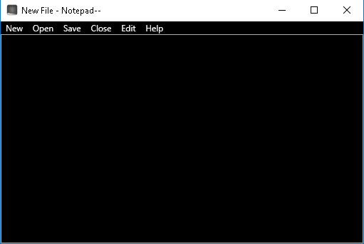

# Notepad--
Notepad-- a dark themed Win Notepad using C# and WPF.
It works! Basic text editing, new file, file open and file save work. :)
 To Do:
 *  Add hotkeys (file new, open, save, exit)
 *  Basic Find ability
 *  Add a Replace ability to find ability
 *  Add line numbers (and ability to take away line numbers)
 *  Add status bar (show current line and column number)
 *  Add more options (maybe an View toolbar for font, font-size, and so on).

